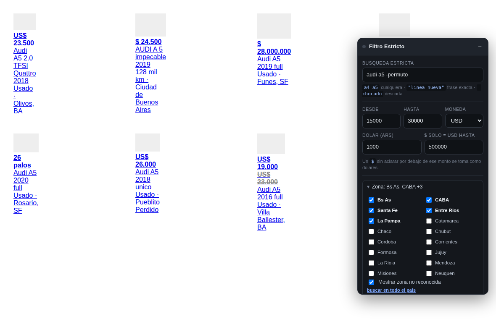
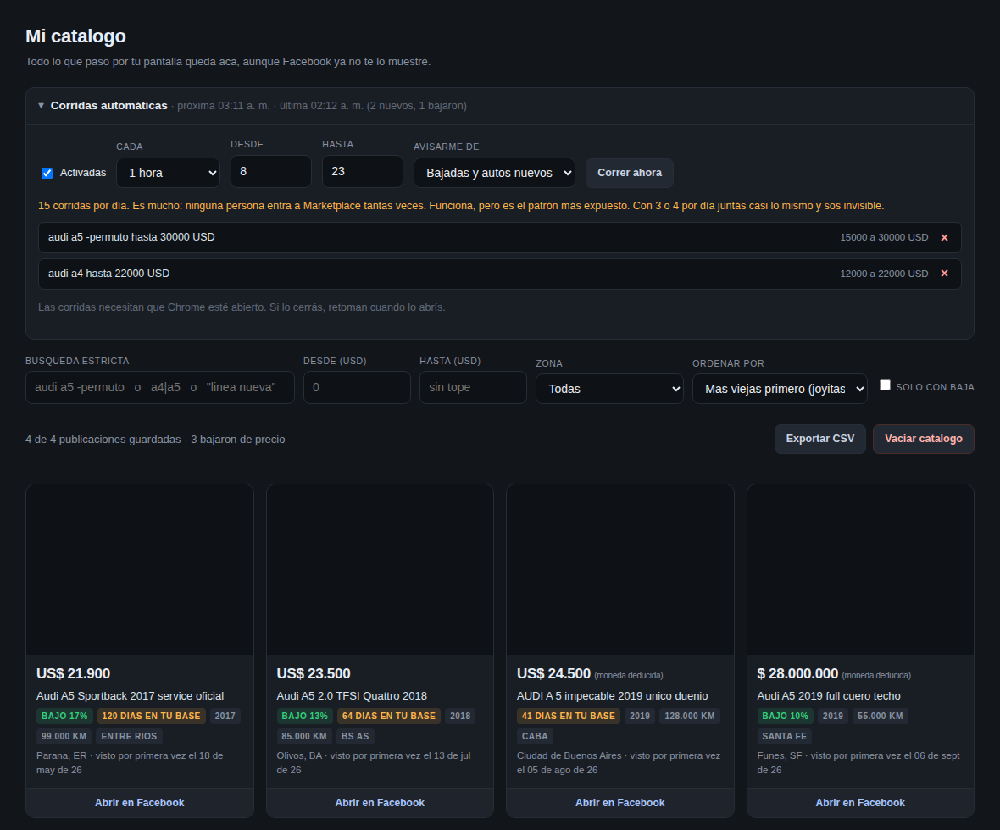

# Marketplace Filtro Estricto

Extensión de Chrome para buscar autos en Facebook Marketplace sin el ruido que
mete Facebook: si buscás **Audi A5**, ves **solo Audi A5** — no A1, ni A3, ni A4,
ni otras marcas — y solo dentro del rango de precio que pediste.

Además arma un **catálogo local** con todo lo que pasó por tu pantalla, para que
las publicaciones viejas que Facebook entierra no se te pierdan nunca más.



## Qué resuelve

| El problema de siempre | Lo que hace la extensión |
|---|---|
| Buscás "Audi A5" y te aparecen A1, A3, A4 y otras marcas | Coincidencia estricta en el título: si no dice A5, no aparece |
| Las publicaciones viejas quedan enterradas en el fondo | Todo lo que ves queda guardado en tu PC y se puede ordenar **de la más vieja a la más nueva** |
| Dice "resultados fuera de tu zona" pero son de tu zona | Filtrás vos por provincia, con una lista que elegís a mano |
| Precios mezclados en dólares y pesos | Detecta la moneda y compara todo contra un mismo rango |
| Vendedores que ponen `$1` para figurar arriba | Se descartan como relleno |
| El que pone `13` en vez de 13.000, o `26 palos` | Lo entiende y lo mete en el rango en vez de perderlo |
| No te enterás de nada si no entrás a mirar | Busca sola durante el día y te avisa con una notificación |
| No sabés quién bajó el precio | Lee el precio viejo tachado y te lo marca desde el primer día |
| No te enterás cuando alguien baja el precio | El catálogo guarda el historial y te marca **cuánto bajó** |



## Instalación en Windows

No está en la Chrome Web Store, así que se carga como extensión de desarrollador.
Es el procedimiento normal de Chrome y lleva un minuto.

1. Descargá este repositorio: botón verde **Code → Download ZIP**.
2. Descomprimilo en una carpeta fija, por ejemplo `C:\Users\TuNombre\marketplace-filtro`.
   **No la borres ni la muevas después**, Chrome la lee de ahí cada vez que arranca.
3. Abrí Chrome y entrá a `chrome://extensions`.
4. Arriba a la derecha, activá **Modo de desarrollador**.
5. Clic en **Cargar descomprimida**.
6. Elegí la carpeta `extension` que está adentro de lo que descomprimiste
   (la que tiene el archivo `manifest.json`).
7. Listo. Entrá a Facebook Marketplace y vas a ver el panel arriba a la derecha.

El panel aparece **solo dentro de Marketplace**. En el resto de Facebook la
extensión no hace absolutamente nada, aunque tenga permiso para el sitio: ese
permiso es necesario porque Marketplace se abre navegando por dentro de
Facebook, sin recargar la página, y de otro modo el panel nunca se activaría.

> Si usás **Edge**, es igual pero en `edge://extensions`.

## Cómo se usa

En el campo **Búsqueda estricta** escribís lo que querés que diga el título:

| Escribís | Qué hace |
|---|---|
| `audi a5` | El título tiene que decir **audi** Y **a5**. A4, A3 y A50 quedan afuera |
| `a4\|a5` | Cualquiera de los dos modelos |
| `"línea nueva"` | Esa frase exacta, en ese orden |
| `audi a5 -permuto -chocado` | Audi A5, pero descarta los que digan permuto o chocado |

Después ponés **Desde** y **Hasta** con el rango de precio y elegís la moneda.
Todo lo que no coincida desaparece de la pantalla al instante.

### El dólar y el peso

En autos los vendedores mezclan monedas todo el tiempo. La extensión funciona así:

- Si el aviso dice `US$`, `u$s` o `USD` → es dólares, sin dudas.
- Si dice `ARS` o `pesos` → es pesos.
- Si dice solamente `$`, decide por el monto: por debajo del umbral que configurás
  (500.000 por defecto) lo toma como dólares, porque ningún auto vale 23.500 pesos.

Cargá el valor del dólar en el campo **Dólar (ARS)** para que los avisos en pesos
se puedan comparar contra un rango en dólares. Actualizalo de vez en cuando.

### Precios abreviados y trucos de vendedor

Mucha gente no escribe el precio completo. Si eso no se interpreta, esos avisos
quedan afuera del rango y los perdés justo a ellos. La extensión los entiende:

| Lo que escribe el vendedor | Lo que entiende la extensión |
|---|---|
| `13` o `$ 13` | 13.000 dólares |
| `13.5` o `13,5` | 13.500 dólares |
| `13k` o `13 mil` | 13.000 |
| `13 palos`, `13 millones` | 13.000.000 de pesos |
| `26 palos` | 26.000.000 de pesos (≈ 26.000 dólares) |
| `$ 850` | 850.000 pesos |

Los precios de relleno para figurar primero en el orden por precio (`$1`, `$111`,
`$123`) se descartan: el aviso queda **sin precio**, y lo ves solo si tildás
*Mostrar también los sin precio*. El precio nunca se busca en el título ni se
inventa de ningún otro lado.

En el catálogo, todo precio deducido queda marcado —*estaba abreviado*,
*moneda deducida*— para que sepas cuál conviene confirmar antes de escribirle
al vendedor.

### Filtro por provincia

Facebook escribe la zona de tres formas distintas en la misma página:

```
Usado · Olivos, BA
128 mil km · Ciudad de Buenos Aires
Usado · Ciudad de Buenos Aires, CF
```

Fijate que le pega adelante el estado (`Usado ·`) o el kilometraje
(`128 mil km ·`). La extensión separa eso y se queda solo con la zona, después
deduce la provincia de tres maneras: por la abreviatura que va después de la
coma (`BA`, `CF`, `SF`, `ER`, `LP`…), por el nombre escrito completo, o por la
localidad si es conocida (`Olivos` → Buenos Aires, `Palermo` → CABA,
`Villa Carlos Paz` → Córdoba).

En el panel abrís **Zona** y marcás las provincias que te sirven. Vienen
marcadas Buenos Aires, CABA, Santa Fe, Entre Ríos y La Pampa; podés cambiarlas
o tocar *buscar en todo el país* para desactivar el filtro.

> **Una publicación cuya localidad no se reconoce NO se descarta.** Es a
> propósito: la lista de localidades no puede ser completa, y perder una
> publicación buena por un pueblo que no está en la lista es peor que ver una de
> más. Si preferís lo contrario, destildá *Mostrar zona no reconocida*.

### Quién bajó el precio

Cuando un vendedor baja el precio, Facebook lo muestra así en la tarjeta:

```
$11.000  $̶1̶3̶.̶0̶0̶0̶
```

La extensión lee los dos: se queda con el actual para filtrar, y guarda el
tachado como precio anterior. Eso significa que **el catálogo te marca las
bajadas desde el primer día**, sin esperar a juntar historial propio.

Tenés además un tilde **Solo los que bajaron de precio** en el panel: con eso
la búsqueda te deja únicamente los vendedores que ya movieron el precio, que
son los que están dispuestos a negociar.

> Para distinguirlas, pasá el mouse por encima de la etiqueta verde en el
> catálogo: te dice si la baja la informó Facebook o la detectamos nosotros
> comparando contra lo que teníamos guardado.

### El barrido automático

El botón **Barrer hasta el fondo** hace el scroll por vos hasta que se acaban los
resultados, para no bajar media hora a mano.

Está hecho a propósito **sin apuro**: baja de a poco, como una rueda de mouse real,
con pausas de varios segundos entre tandas y pausas más largas cada tantas.
Si tocás el scroll vos, se aparta y espera a que termines.

Podés dejarlo trabajando mientras hacés otra cosa.

Tiene tres velocidades, en **Velocidad del barrido**:

| Velocidad | Ritmo | Cuándo usarla |
|---|---|---|
| **Tranquilo** | el más lento | Es el que viene puesto. Indistinguible de una persona |
| **Normal** | unas 5 veces más rápido | El equilibrio razonable para barrer a mano |
| **Rápido** | unas 29 veces más rápido | Junta muchísimo, pero es el patrón de carga más marcado |

En las tres el ritmo lleva variación al azar: lo que delata a un robot no es la
velocidad, es la regularidad.

## Corridas automáticas

La extensión puede buscar sola durante el día, sin que vos hagas nada.

**Cómo funciona:** guardás tus búsquedas, y cada tanto la extensión abre
Marketplace **en una pestaña de fondo** —no te interrumpe—, hace un barrido
corto, guarda todo en el catálogo y cierra la pestaña. Sigue sin ser
automatización detectable: es tu Chrome, tu sesión, tu IP, leyendo lo que la
página ya cargó.

Y cuando encuentra algo, **te avisa con una notificación**: un auto nuevo dentro
de tu rango, o —lo más valioso— alguien que **bajó el precio** de un auto que ya
tenías fichado.

### Cómo dejarlo andando

1. En Marketplace, armá la búsqueda como la querés (texto, precio, zona).
2. Tocá **Guardar esta búsqueda** en el panel. Repetilo por cada búsqueda.
3. Abrí el catálogo, desplegá **Corridas automáticas** y activalas.

> Conviene que antes ordenes Marketplace por **fecha de publicación, más
> recientes primero**. La corrida automática hace un barrido corto —lo nuevo
> está arriba— así que con ese orden ve lo nuevo enseguida. El barrido profundo
> lo hacés vos a mano cuando querés.

### Dos límites que tenés que saber

**Chrome tiene que estar abierto.** Si apagás la máquina o cerrás Chrome, no
corre; retoma cuando lo abrís. No hay forma de evitarlo sin un servidor, y un
servidor sí sería scraping detectable.

**La frecuencia es el riesgo.** Tres o cuatro corridas al día es indistinguible
de una persona que mira Marketplace varias veces. Cada quince minutos, o de
madrugada, es un patrón que ninguna persona tiene. Por eso:

- Nunca corre fuera de la franja horaria que elijas (8 a 23 por defecto).
- El horario se mueve unos minutos al azar en cada corrida, para no ser un reloj.
- El panel te dice cuántas corridas por día implica tu configuración, y te avisa
  cuando te estás pasando.

La elección es tuya y la extensión no te la bloquea. Pero si me preguntás,
**3 corridas por día alcanzan**: el catálogo crece igual y sos invisible.

## El catálogo: de dónde salen las joyitas

Este es el corazón del asunto.

Cada publicación que pasa por tu pantalla queda guardada en tu computadora. Eso
significa que **una vez que la viste, ya no se pierde nunca**, aunque Facebook la
entierre en el fondo al día siguiente.

Abrilo con **Abrir mi catálogo** (o con el ícono de la extensión). Adentro podés:

- Filtrar por **provincia** (solo aparecen las zonas que realmente tenés guardadas).
- Ordenar **de la más vieja a la más nueva** → ahí están las publicaciones que
  nadie mira hace meses, que es donde suele estar el precio bueno.
- Ver **quién bajó el precio y cuánto** → la extensión guarda el historial de cada
  aviso. Un auto que bajó 17% es un vendedor apurado. Ese es el momento de escribirle.
- Filtrar con la misma búsqueda estricta sobre todo tu historial.
- Exportar a **CSV** para abrirlo en Excel.

A las dos semanas de uso normal tenés tu propio catálogo de autos, buscable de
verdad, mientras Facebook te sigue mostrando su desorden.

## Sobre el riesgo de que te bloqueen

Está pensada para no llamar la atención, y conviene entender por qué:

- **No le pide nada a Facebook.** Los datos los carga la página, con tu sesión y
  tu navegador de siempre. La extensión solo lee lo que ya está en tu pantalla y
  esconde lo que no sirve. Desde el servidor de Facebook, eso es indistinguible
  de vos mirando el monitor.
- **No usa automatización detectable.** No hay Selenium ni Playwright manejando el
  navegador, que es lo que Facebook sí detecta.
- **No manda mensajes ni hace clics automáticos.** Eso es lo que dispara bloqueos
  rápido, y la extensión no lo hace.
- **Nada sale de tu máquina.** El catálogo vive en tu PC. No hay servidor, no hay
  cuenta, no se envía nada a ningún lado.

El único punto de contacto es el ritmo del barrido, y por eso está deliberadamente
lento y con pausas variables.

Aclaración honesta: filtrar y guardar localmente lo que ya ves va contra los
Términos de Servicio de Facebook, igual que cualquier bloqueador de publicidad.
Es tu cuenta, tus ojos y uso personal.

## Si algo deja de andar

Facebook cambia su código seguido. La extensión está hecha para aguantarlo:
**no usa ni una sola clase CSS de Facebook**, porque están ofuscadas y cambian
cada pocas semanas. Se apoya únicamente en el link de cada publicación
(`/marketplace/item/…`), que Facebook no puede cambiar sin romper su propio sitio.

Si algún día no detecta las tarjetas:

1. Recargá la página de Marketplace.
2. Entrá a `chrome://extensions` y tocá el botón de recargar de la extensión.
3. Si sigue sin andar, avisá: el archivo a revisar es
   `extension/src/content/scraper.js`.

## Para desarrollar

```bash
npm install
npm test          # 66 pruebas de lógica y agenda + 61 de navegador real
```

Las pruebas levantan Chromium contra una réplica del DOM de Marketplace y
verifican que el filtrado deje exactamente las publicaciones correctas. El
catálogo se sirve por http porque usa módulos ES, igual que dentro de la
extensión.

### Estructura

```
extension/
  manifest.json
  src/
    lib/
      normalize.js    Texto sin tildes y en minúsculas
      price.js        Parseo de precios argentinos (USD y ARS mezclados)
      matcher.js      Coincidencia estricta de títulos  <- el corazón
      zonas.js        Provincias argentinas y sus abreviaturas
      agenda.mjs      Cuándo toca la próxima corrida automática
    content/
      scraper.js      Lectura del DOM sin usar clases de Facebook
      panel.js        Panel flotante (shadow DOM)
      autoscroll.js   Barrido a ritmo humano
      content.js      Orquestador
    background/
      background.js   Base de datos local, corridas automáticas y notificaciones
    catalog/          La página del catálogo histórico
  icons/            El ícono de la extensión y de las notificaciones
tests/
  test-logica.js      Matcher, precios y zonas
  test-agenda.mjs     Programación de las corridas automáticas
  test-dom.js         Integración en Chromium real
  test-catalogo.js    La página del catálogo, servida por http
```
